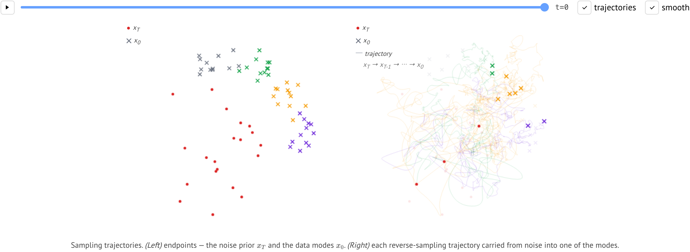
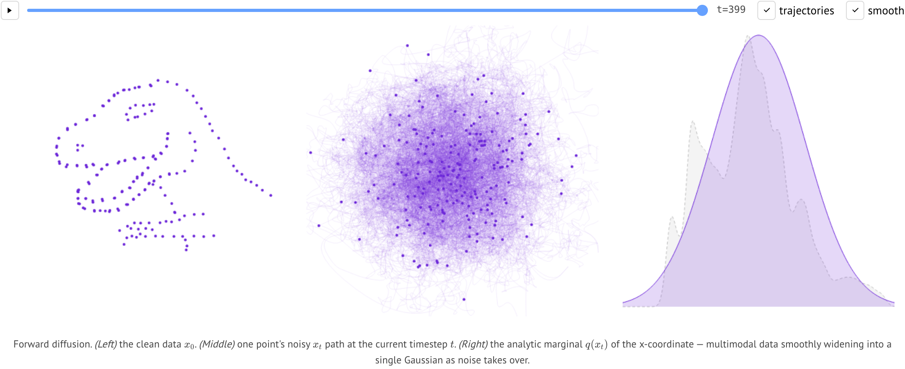

# ddpm — visual intuition for diffusion models

An interactive, step-by-step visualization of how a **DDPM** (Denoising Diffusion
Probabilistic Model) turns noise into data — and back. Trained offline in
PyTorch, replayed in the browser as a static page.

**Live demo →** https://parkcheolhee-lab.github.io/ddpm/

*Reverse-sampling trajectories carrying noise (xₜ) into the data modes (x₀).*

*Forward diffusion — a dino dissolving into Gaussian noise, with the analytic marginal q(xₜ).*

## What it shows

On 2D Datasaurus toy shapes (dino, star, circle, …):

- **Forward** — a shape dissolving into Gaussian noise, with the analytic marginal _q(xₜ)_.
- **Reverse** — ancestral sampling walking noise back into the shape.
- **Training** — generated samples sharpening as the denoiser learns.
- **Modes** — noise → data transport trajectories on a few Gaussian modes.

## How it works

The model is trained **offline in PyTorch** (`ddpm/src/`). `export_viz.py` then
records every frame as **precomputed JSON** under `docs/data/precomputed/`, and
the page (`docs/`) is a **pure client-side viewer** — plain JS replays the JSON
on `<canvas>`. No server, no Python/ML in the browser.

## Layout

| Path | What |
|---|---|
| `ddpm/src/` | PyTorch DDPM (model, scheduler, dataset, trainer) + `export_viz.py` |
| `docs/` | static site (HTML/CSS/JS) + precomputed JSON |
| `tests/` | `pytest` (Python) + Playwright (viewer) |

See [`docs/README.md`](docs/README.md) for the full data contract and a
section-by-section walkthrough of the page.
